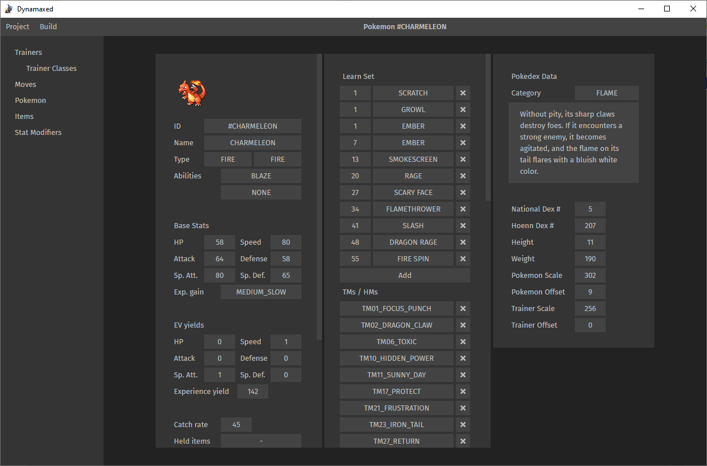

## Purpose

Dynamaxed is a graphical editor for the PRET/pokeemerald project in order to make it easier to add, remove and change things like trainers, pokemon, items, etc. It will also come with a full MSYS2 dev environment so you won't need to go through the tedious process of creating one yourself.

It is primarily intended to be an alternative to AdvanceMap for modders who have little to no understanding of C or programming in general and want to get a quick start on modding.

## How it works

This project requires tyranteon/dynamaxed-emerald as a base, which is a slightly modified version of the pret/pokeemerald project. It's modified in a way to allow generated code on one hand while still allowing you to manually modify the rest of the code if you so desire. 

## Development
```
yarn install
```

### Compiles and hot-reloads for development
```
yarn electron:serve
```

### Produces executable
```
yarn electron:build
```

### Libraries
Library|Purpose
---|---
TypeScript / TSX | Main programming language
TypeStyle | For typed CSS in JS
VueJS | UI / Reactivity framework
Electron | To use JavaScript as a Desktop Application
Portal-Vue | In order to update the page title according to View changes

### Folder Structure
Folder | Purpose
---|---
`src`| contains all typescript source files
`src/build-tools` | TODO: builds the MSYS2 System from scratch
`src/components` | All the VueJS components
`src/components/dialogs` | The dialogs to use with `DialogManager.openDialog()`
`src/components/displays` | Components for displaying singular properties (like Money, items, etc), mostly for use on buttons or list entries.
`src/components/lists` | All the overview lists
`src/components/views` | The views to use with `ViewManager.openView()`
`src/model` | The GameModel which serializes the data into the `.dynamaxed`-folder in the dynamaxed-emerald project.
`src/model/defaults` | The initial defaults for all elements. Will be moved to a different repo in the future.
`src/model/serialize` | Functions to transform the JSONs to `.h`, `.c` and `.s` files into their respective directories for use with `make`
`src/modules` | Global objects which constitute the state of the program (store).


## TODO-List

- Auto ID system
- Filter options
- Auto Filtering for Held Items and Trainer usable items
- Drag & Drop Pokemon (and other types of lists)
- Name length and entity verification
- Undeletable objects
- Trainer Rematches
- Type effectiveness chart
- Display Pokemon Type and Stats

- Untangle Menubar into 3 components
- Dependency Injection for the modules
- return Vue.observable().
- Allow customization of run path
- Get ABGCC into the msys build system
- Watch folder and update dynamaxed automatically
- Remove the . from .dynamaxed folder 
- migrate dynamaxed-emerald to the current version -- consider import functionality from non-dynamaxed projects
- implement forward button
- auto update and version checking
- Support to edit maps and tilesets
